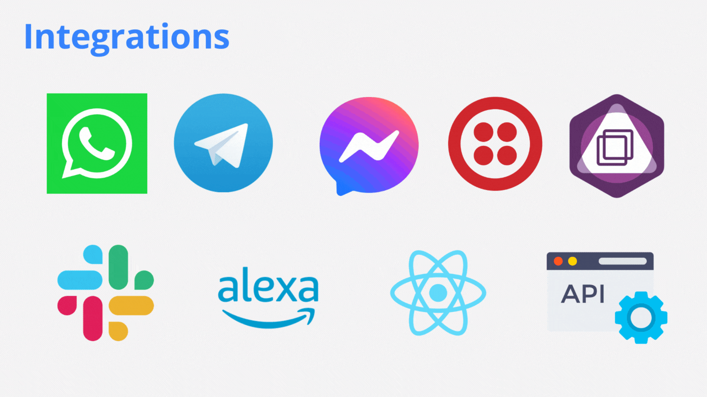
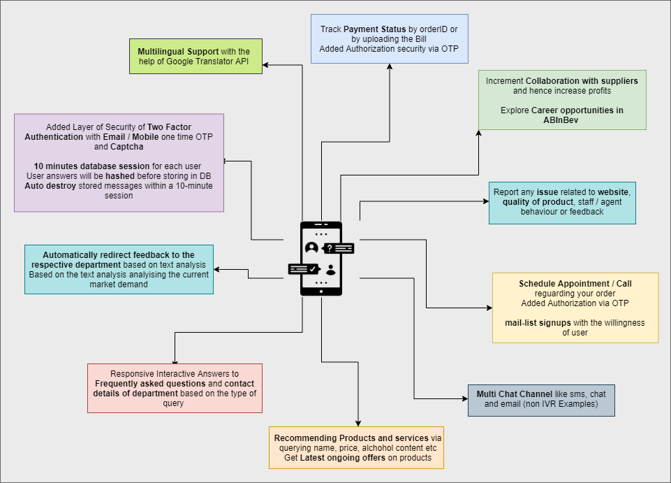
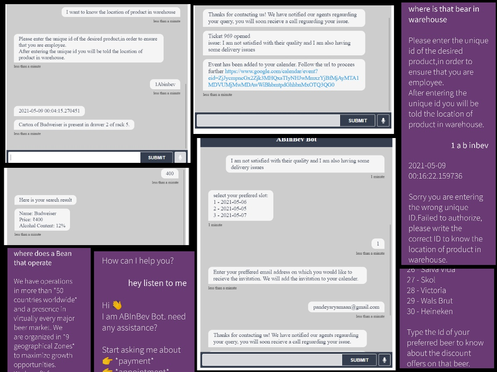
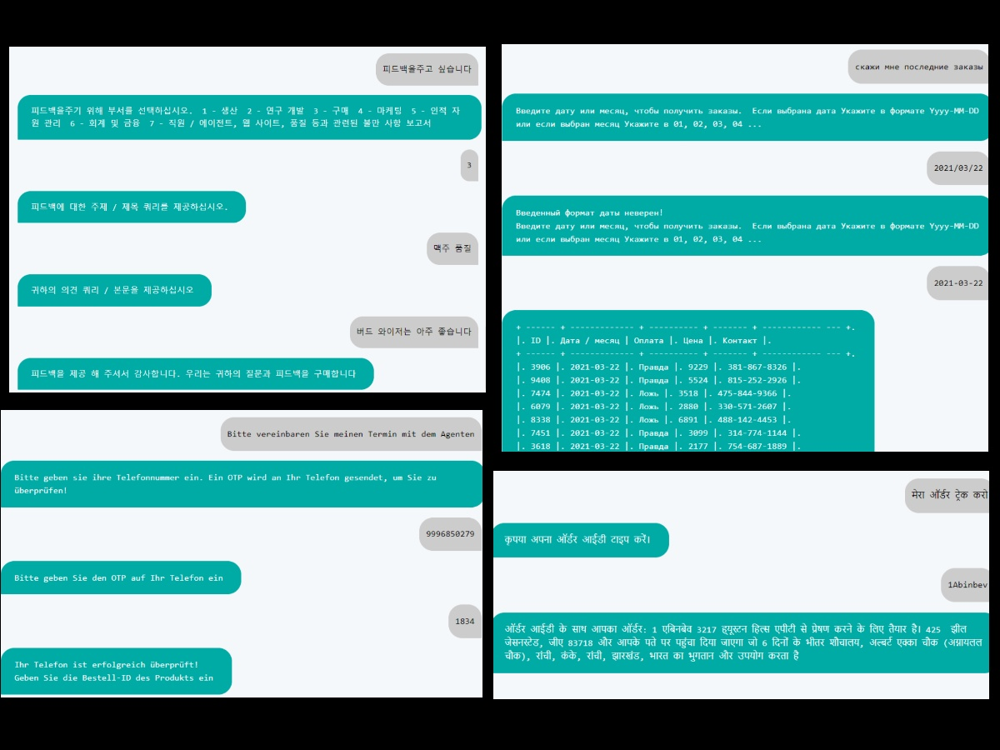
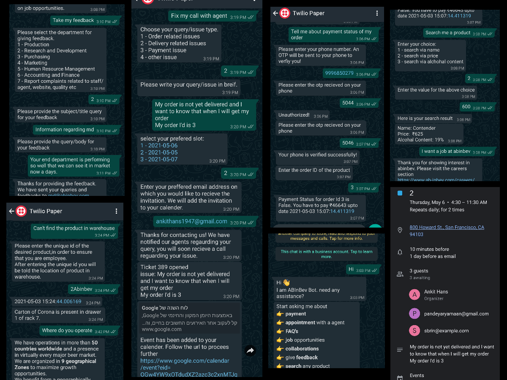
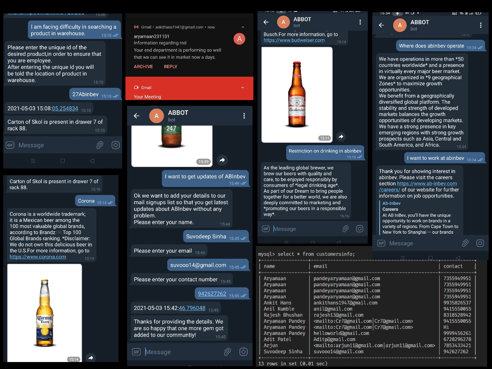
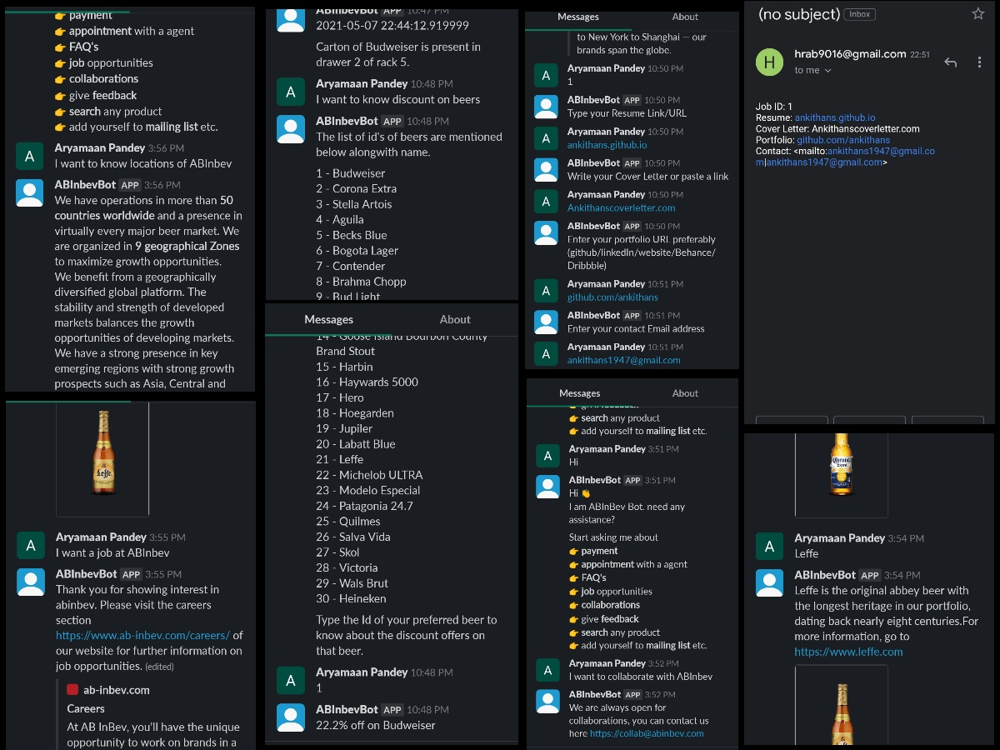
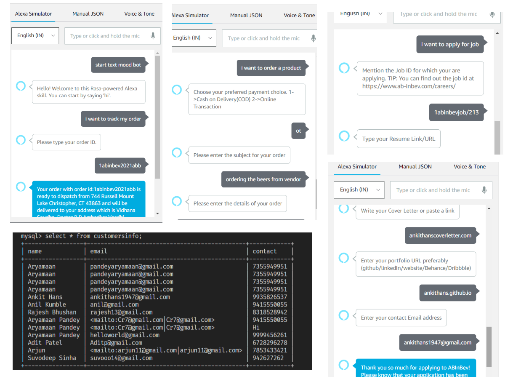

# IVR-Chatbot

## Achievements🏆
Team Uhtred won the Maverick 2.0 Bot-a-thon 2021 organized by AbInbev India.

## ❓ Problem Statement
> As we all know that, lot of tedious/complex tasks are going on in companies and organizations such as procurement, finance and accounting, human resources, supply chain management and IT. These processes require huge amount manpower and effort, so we thought to devise a solution which can proactively interact with the customers and vendors 24/7 and solve their problems with minimal efforts on the company's side.

## 💡 Solution
> IVR chatbots can be a boon for the companies to manage their work processes easily and smoothly so we developed it. Companies can use it to improve their customer's experience, to generate more sales and build a deeper rapport with customers. They allow your customers to easily interact with your brand through stimulated conversations. It is capable of providing 24h service to their customers. For a good customer experience it provides instant and accurate results to the questions asked by users.

## ✨ Presentation
- [PPT](https://www.canva.com/design/DAEd-OD4XEY/6KDX1GKeaSY6Ke1vZZpb7Q/view?utm_content=DAEd-OD4XEY&utm_campaign=designshare&utm_medium=link&utm_source=sharebutton)
- [Video Presentation](https://vimeo.com/547184353)




## 🎯 Features

### Consumers
- Track `Payment Status` by orderID
- Added `Authorization` security via OTP
- Explore `career opportunities` and `screening` of candidate seeking for a job at ABInBev
- Report any issue related to website, quality of product, staff / agent behaviour or `feedback`
- Schedule `Appointment/Call` regarding any queries like order, quality of product, delivery, payment issues etc.
- `mail-list` signups with the willingness of user inorder to increase the customer engagements
- `Recommending Products` and services via querying name, price, alcohol content etc
- Get Latest ongoing `offers` on products
- Responsive Interactive Answers to `Frequently asked questions (FAQ)` and contact details of department based on the type of query
- Order a product using chatbot and get `e-receipt (Procurement)`
- Know the location of your package `(delivery details)`

### Vendors
- Increment `Collaboration` with suppliers and hence increase profits
- Grab the `recent orders` by entering the date or month
- Resetting of database session for each user after some interval of time
- Get `location` of any product in `warehouse`
- `Supplier onboarding`
- Get complete information about `any beer` with image available at ABInbev

### Integrations
- `Multilingual Voice support` using speech to text and text to speech API's
- `Multi Chat Channel` like sms, chat (`Telegram, Whatsapp, Slack, Facebook Messenger, Alexa, Aimybox`) and email (non IVR Examples)

## 🤖 How we built it


## 🙈 Mockups

### Text to Speech and Speech to Text


### Multilingual Support



### Whatsapp


### Telegram


### Slack


### Alexa



## 👣 steps to run the project
### Run rasa and rasa action server
```bash
cd app
pip install requirements.txt

# In one terminal do
rasa run
# In other do
rasa run actions
```

### Run Multilingual React Bot
For Fastapi (backend) server
```bash
cd IVR-multilingual
cd api
uvicorn main:app --reload
```
For react (frontend) app
```bash
cd IVR-multilingual
cd frontend
npm install
npm start
```

### Run Voice bot in terminal
```bash
cd IVR-terminal
python voice.py
```

### Run Web Chat Voice Bot
```bash
cd IVR-web-eng
# and run the html file using live server
```

## 💻 Tech Stack & dependencies
Python, RASA, SQL, gTTS, Twilio, Google Calender API, Google Translator, playsound, prettytable, PyAudio, requests, SpeechRecognition, android, HTML, geopy, opencage, pyauthorize, spacy, smtp, FastAPI

## made with 💕 by:
- [Ankit Hans](https://github.com/ankithans)
- [Aryamaan Pandey](https://github.com/aryamaan23)
