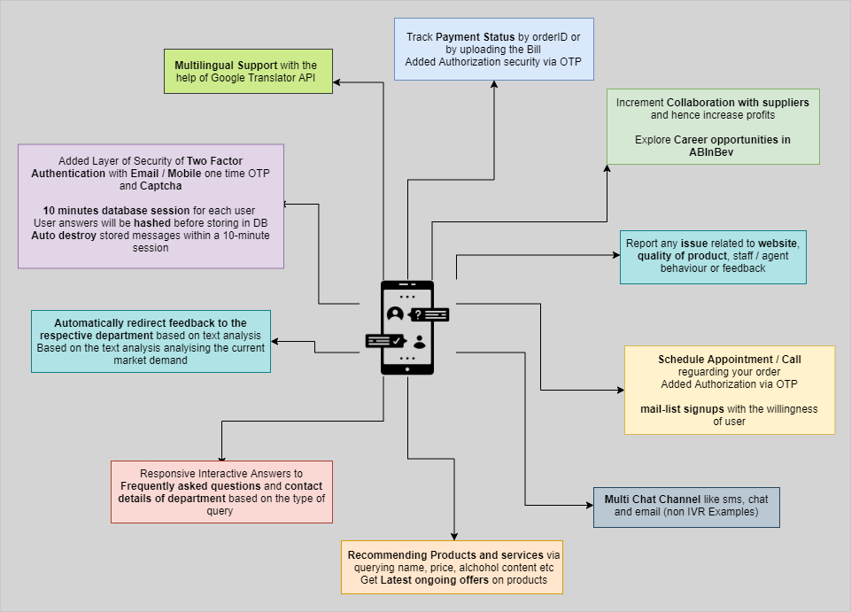
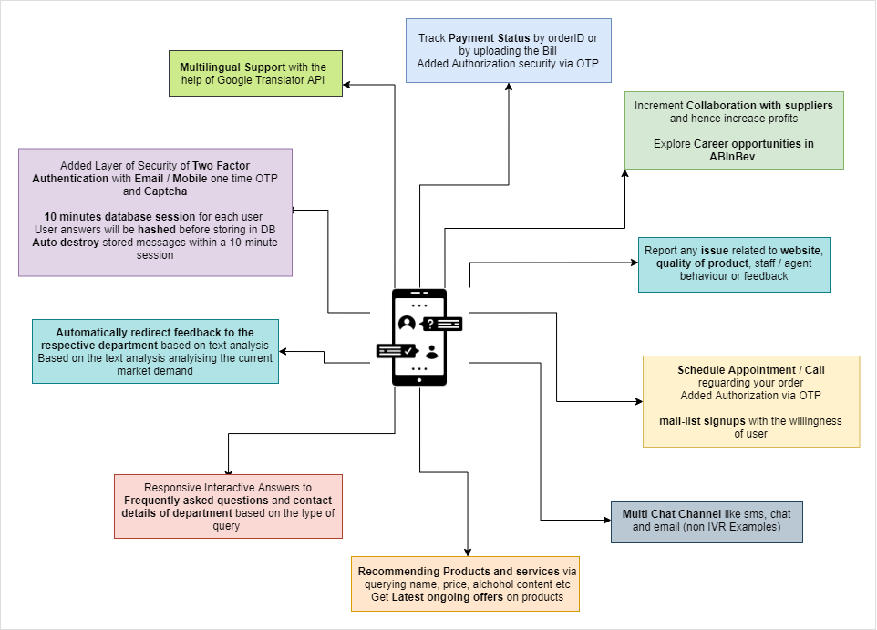

# IVR-Chatbot

## ❓ Problem Statement
> As we all know that, lot of tedious/complex tasks are going on in companies and organizations such as procurement, finance and accounting, human resources, supply chain management and IT. These processes require huge amount manpower and effort, so we thought to devise a solution which can proactively interact with the customers and vendors 24/7 and solve their problems with minimal efforts on the company's side.

## 💡 Solution
> IVR chatbots can be a boon for the companies to manage their work processes easily and smoothly so we developed it. Companies can use it to improve their customer's experience, to generate more sales and build a deeper rapport with customers. They allow your customers to easily interact with your brand through stimulated conversations. It is capable of providing 24h service to their customers. For a good customer experience it provides instant and accurate results to the questions asked by users.

## 🎯 Features

- Track Payment Status by orderID
- Added Authorization security via OTP
- Increment Collaboration with suppliers and hence increase profits
- Explore Career opportunities in ABInBev
- Report any issue related to website, quality of product, staff / agent behaviour or feedback
- Schedule Appointment / Call regarding your order
- mail-list signups with the willingness of user and store the information of users in a SQL DB
- Multi Chat Channel like sms, chat and email (non IVR Examples)
- Recommending Products and services via querying name, price, alcohol content etc
- Get Latest ongoing offers on products
- Responsive Interactive Answers to Frequently asked questions (FAQ) and contact details of department based on the type of query
- Automatically redirect feedback to the respective department based on text analysis.Based on the text analysis analyzing the current market demand
- 10 minutes database session for each user
- Auto destroy stored messages within a 10-minute session
- Order a product using chatbot and get e-receipt (Procurement)
- Get location of any product in warehouse
- Supplier onboarding
- Screening a candidate seeking for a job
- Know the location of your package (delivery details)
- Get complete information about any beer available at ABInbev


## 🤖 How we built it




## 🙈 Mockups

### Whatsapp


### Telegram


### Slack


## 👣 steps to run the project
### Run rasa and rasa action server
```bash
cd app
pip install requirements.txt

# In one terminal do
rasa run
# In other do
rasa run actions
```

### Run Voice bot in terminal
```bash
cd IVR-terminal
python voice.py
```

### Run Web Chat Voice Bot
```bash
cd IVR-web-eng
# and run the html file using live server
```

## 💻 Tech Stack & dependencies
Python, RASA, SQL, gTTS, Twilio, Google Calender API, Google Translator, playsound, prettytable, PyAudio, requests, SpeechRecognition, android, HTML

## made with 💕 by:
- [Ankit Hans](https://github.com/ankithans)
- [Aryamaan Pandey](https://github.com/aryamaan23)
